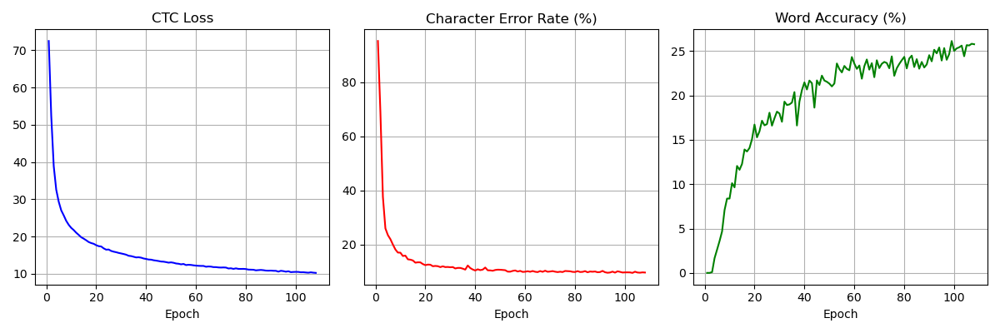

# AI Project 2025  

Authors:  Tobias Kaltenbrunner
          Anna Zierlinger
          Stefanie Biber
----          
## Documentation

### Motivation/State of the Art

#### Motivation
The motivation for our Project is to find out existing methods of handwritten text recognition and apply them to a real world use case. 
    The final longterm goal would be to find specially marked TODOs in a PDF,translate them to text and then port them to calendar entries
    This project will focus more on the second step of translating handwritten text to computational txt files. 
    
#### State of the Art
A widely used Setup used Recurrent Neural Networks (RNNs). Especially Bidirectional LSTM (BiLSTM) combined with Connectionist Temporal Classification (CTC). With this the model can learn alignments between Input sequences and Output sequences without explicit Segmentation. 

Recent advances shifted towards Transformer-based models. They outperform RNNs in accuracy and Training Efficiency. One notable model is TrOCR (Transformer-based OCR) by Microsoft. This uses a Vision Transformer (ViT) Encoder and a Transformer Decoder. 

Pretrained Models and Transfer learning have become essential for achieving high accuracy on smaller datasets. There's also growing interest in Explainable AI techniques like Gradcam to Interpret the models decisions.

Overall, modern HTR Systems are shifting from RNN-based sequence models to Transformer-based architectures, improving both recognition accuracy and adaptability to various handwriting styles.

We, however, chose to still use RNN as we didn't want to use a pre-trained model and didn't have the Hardware resources for larger architectures.


### Methods

1. Preprocess images with `src/preprocessor.py`.
2. Load data splits using `src/dataloader_iam.py`.
3. Train the CNN+LSTM network defined in `src/model.py` via `src/main.py`.
4. Evaluate with different CTC decoders (best path, beam search, word beam search) and the resulting CTC loss.

#### AI Algorithms and Architecture

The base of the HTR (handwritten text recognition) system is implemented with TensorFlow and then trained on the IAM off-line HTR dataset (word.zip) and consists of convolutional layers followed by bidirectional LSTM layers.
The model and architecture we used is called a CRNN Model.

For the dataset download the words.tgz & ascii.tgz file from https://fki.tic.heia-fr.ch/
Move the contents of words.tgz into data/img and the contents of ascii.tgz to data/gt

**CRNN** = Convolutional Recurrent Neural Network specialized in deep learning architecture and designed to handle tasks like handwriting recognition - CRNN processes entire text lines.
The three main components our the CRNN architecture we used are as following:

**1. CNN:**  
To extract spatial features from the input image in order to help recognize strokes, shapes and textures of the handwritten characters. In here the image dimensions are reduced without eliminating the essential structure.  
  
**2. RNN:**   
The output of the CNN is passed through the recurrent NN using bidirectional LSTM layers in this project. This helps the model to understand the sequential dependencies to enable handwritten word recognition without the need to explicitly segment individual characters.
  
**3. CTC Loss & Decoding:**   
CTC loss function gives the model the ability to predict sequences without requiring fixed alignments between images and output text. This is necessary, because handwriting is naturally unsegmented and therefore not well-equipped to use traditional classification approaches.


The model in total consists of 5 CNN layer, 2 RNN layer and the CTC loss and decoding layer.

Pros:
- Lightweight, less accurate  
- Outdated but easier to train

#### Hyperparameters

The training varied in the use of different batch sizes (250, 500, 700 -> GPU memory not efficient) and early stopping after 3 epoches for first test and plots and a good comparison of the learning curve and decreasing character error rate and later on after 25 epochs.
The images are resized to a height of 32 pixels while the width depends on whether single words or text lines are processed.


### Results

In order to achieve similar results as in the pre-trained model with our self trained models, we used `--mode train` and `--early_stopping 3/20`

Due to our variation with the batch size, `--fast` mode from lmdb, the additional use in some training of the `--deccoder wordbeamsearch` and adaption of the hyperparameters we achieved similar results regarding the character error rate of approximately 10% for the character model and about 11% for the line model.
Word Beam Search has changed the result only for the better, after we used our self created pre-trained model. We came to the conclusion, that some characters seem to have been ignored when using the decoder too early on the trained model. 

#### Performance Comparison

In order to increase / compare the performance, we used different decoders (default & Word Beam Search). Word Beam Search tends to improve word accuracy when a dictionary is available, 
while best path decoding is faster but slightly less accurate.

Furthermore, we used the database LMDB to speed up image loading with the additional value `--fast` when training the model.

With `--decoder wordbeamsearch` & `--early_stopping 20` we reached more than 80 epochs for the line model and achieved the following performance:


and for the word / character model we reached a word accuracy over 70% and a success over 90%  


For the line model, the tricky part lies also in the word accuracy, which is only correct if every word in the selected batch has been translated correctly. This is why we first started the model only with the default decoder and later on continued the training with the decoder wordbeamsearch. We came to the conclusion that this approach is the best regarding performance increasement and a decreased character error rate. 

#### Discussion

Our results show that even a relatively small CNN+LSTM architecture can achieve usable accuracy for HTR. 
Further improvements could be gained by augmenting the training data further, adding the HTRPipeline, adapting the system to newer versions of tensorflow or using pytorch or experimenting with deeper networks.

----

## Implementation

### Data pre-processing (plot some data, data cleaning, data augmentation, divide data in train/validation/test sets)

The `preprocessor.py` class handles the resizing and augmentation of the images. Handwritten text samples vary in dimensions, and resizing them ensures that the model can handle all images uniformly. 

Typically, images are resized to a fixed width while maintaining their aspect ratio.

It can optionally simulate text lines by stitching several word images together and performs photometric and geometric distortions during training which we further used for our line model. 

Img before and after augmentation:  


The table of models used with their parameters:


In total the IAM dataset downloaded is split into 95% training data and 5% validation data by the `DataLoaderIAM` loader.


### Model selection and Training (Use at least 2 Models and/or different hyperparameters (network size, number of nodes etc.)

This is not the state of the art but provides a quick but solid learning process, especially for limited resources. Due to version control and GPU limitations we found this a good methodolgy for training the dataset. 
The project, from which we worked off, didn't use keras, but self created models based on the typical model layering and manipulating of images like Con2d, dropout, .
We believe this further helped out for version control.

We especially differentiated the arguments used for training the data, the batch sizes, including and excluding the CTC decoder Word Beam Search to compare the learning curve and accuracy of the output.
CNN kernel sizes, number of feature maps and number of layers are given in setup_cnn inside the model.py. The lists kernel_vals, feature_vals, stride_vals and pool_vals define the convolution layers.

In total, we have created two trained models:
- line model
- word / character model

We trained our models using the following commands:
```
python main.py --mode train --fast --data_dir ../data  --batch_size 500 --early_stopping 15
python main.py --mode train --fast --data_dir ../data  --batch_size 250 --early_stopping 20
```
Validation runs after every epoch using the same script with `--mode validate`. 
Character error rate and word accuracy are reported and written to `model/summary.json` for later analysis.

Furthermore, we started with a completely different model build on keras but during the process we figured out, that the model misses crucial parts to be able to translater full lines, yet alone a full page - which was the focus of our motivation for this project

#### Command line arguments
* `--mode`: select between "train", "validate" and "infer". Defaults to "infer".
* `--decoder`: select from CTC decoders "bestpath", "beamsearch" and "wordbeamsearch". Defaults to "bestpath".
* `--batch_size`: batch size.
* `--data_dir`: directory containing IAM dataset (with subdirectories `img` and `gt`).
* `--fast`: use LMDB to load images faster - need to clone the repository, `pip install .` in the src folder and in the current project after run `python create_lmdb.py --data_dir ../data`
* `--line_mode`: train reading text lines instead of single words.
* `--img_file`: image that is used for inference.
* `--dump`: dumps the output of the NN to CSV file(s) saved in the `dump` folder.


### Model evaluation (Overfitting/Underfitting, use Regularization if needed)

For single image inference (`--mode infer`) a GradCAM heatmap can be generated with the `--gradcam` option. 
The resulting `gradcam.png` highlights the areas that contributed most strongly to the predicted characters.

In our used model we can not achieve overfitting, since the epochs only run as long until the learning rate isn't increased until a given point (we set it up to 3 and 20 later on).
The model is already using a sort of regularization with this for loop to avoid overfitting in general and achieve fairly fast usable results.

### Explanation i.e. GradCam (which input pixels were most relevant for the output decision)

We further used GradCam and figured out / plotted the mainly needed portions of images needed in order to understand and translate the png files correctly.

### References

Current model references using tf.nn (self created models based on tf):  
https://github.com/githubharald/SimpleHTR  
https://github.com/githubharald/CTCWordBeamSearch?tab=readme-ov-file  
https://keras.io/examples/nlp/text_classification_from_scratch/  
https://github.com/githubharald/HTRPipeline?tab=readme-ov-file
https://medium.com/@pavitharan2020/building-a-handwriting-recognition-system-with-crnn-a-beginners-guide-58a51a46dd15

Reference for our original model using tf.keras:
https://keras.io/examples/vision/handwriting_recognition/
